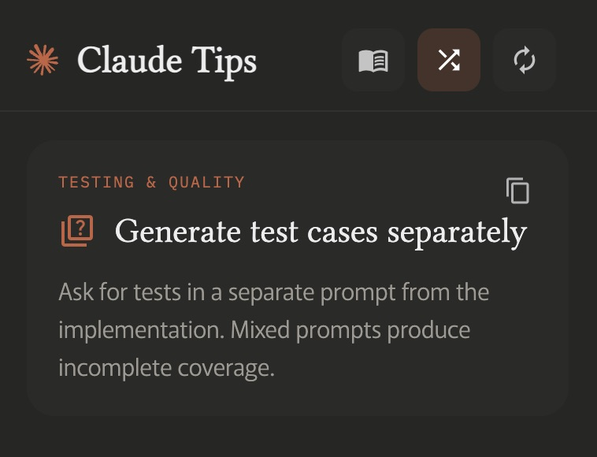

# Claude Tips

A lightweight Chrome extension for Claude users who want to save tokens, sharpen prompts, and get quick guidance while working with Claude.

## What it includes

- A popup interface with categorized tips and a random tip mode
- Practical, minimal cost-saving rules from the Doobie transcript
- Expandable, categorized guidance for chat discipline, measurement, model control, and session strategy
- Material Design icon styling and a dark, calm UI

## Token-saving rules included

- Claude counts tokens, not messages
- Edit instead of following up
- Start fresh every 15–20 messages
- Batch related questions into one prompt
- Track usage with local logs
- Upload recurring files to Projects
- Save memory and user preferences
- Disable unused search/tools features
- Use Haiku for simple tasks
- Spread work across the day
- Avoid peak hours whenever possible
- Enable overage as a safety net

## Credit

Based on the video:

"Never hit Claudes Usage Limit Again" by Dubibubii

https://www.youtube.com/watch?v=2f7ZkImNHFo
